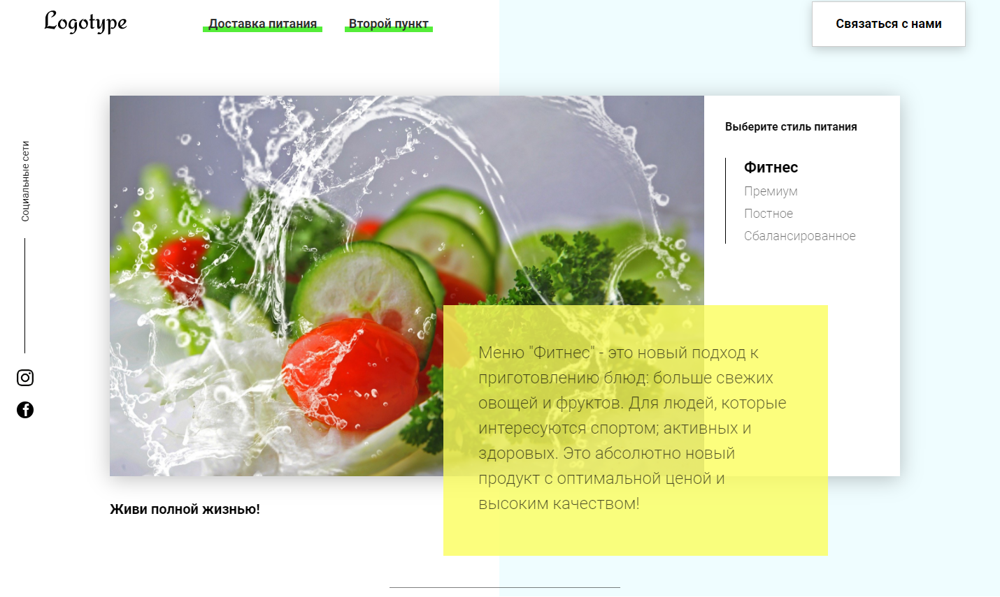
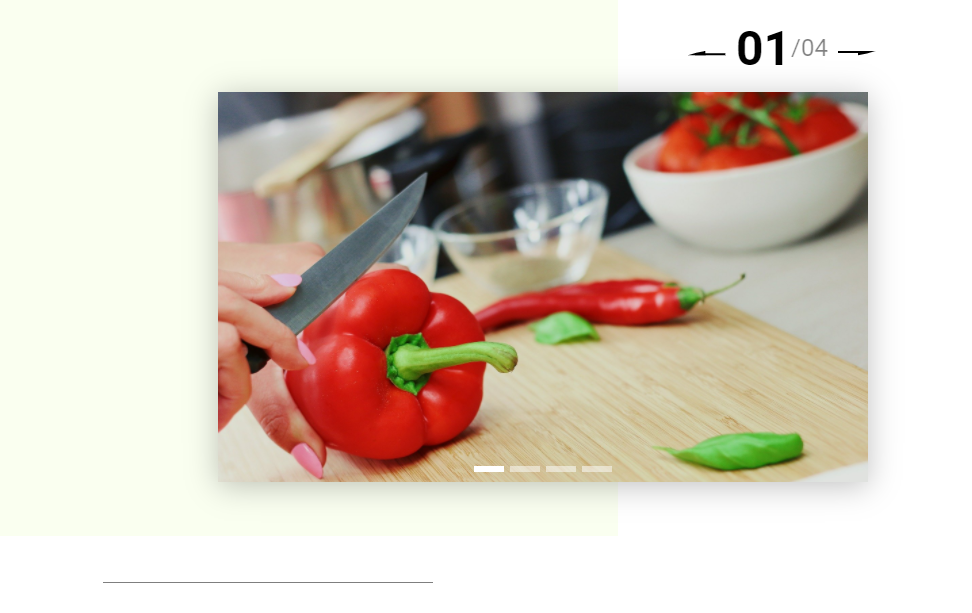
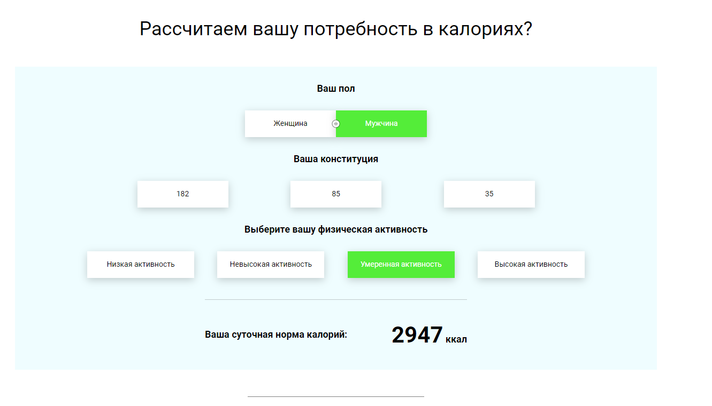

# Food-delivery-site

It's my training project.
The one-page website with a built-in calorie calculator, menu that switches by tab, controlled slider, sales timer. The product cards implemented by package-json server.

    
    
    
    

###
I splited js code into independent modules that all are imported into the main file script.js. And then used a webpack to build modules.
For the cross-browser adaptation I applied a [Babel](https://github.com/babel/babel) compiler.

## Download

You can pull this repo.
Please dont't forget to check package.js and use ' npm -i ' to dowload all dependencies.
Also you will need instal [json-server](https://github.com/typicode/json-server) package as for product cards that is rendering dynamically of the you will need to use the json-server.
